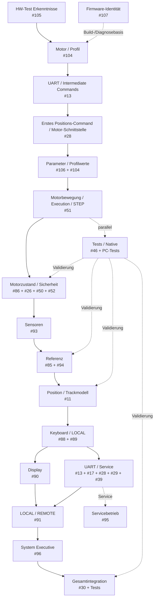

# FY Produktivsoftware – technische Roadmap

> Arbeitsdiagramm für die schrittweise Überführung der Erkenntnisse aus dem FY_HW_TEST in die Produktivsoftware.

## Arbeitsreihenfolge

Die Motorintegration wird bewusst in kleinen, testbaren Schritten aufgebaut. Die echte Hardware ist dabei zunächst **nicht erforderlich**; die Produktivsoftware wird auf dem Schreibtisch-Mockup entwickelt und geprüft.

1. **Firmware-Identität** als kleine Build-/Diagnosebasis festlegen.
2. **Motor-/Profil-Erkenntnisse aus dem HW-Test** übernehmen, ohne den HW-Test-Code zu kopieren.
3. **Intermediate Commands** zuerst produktiv stabilisieren. Damit wird die Kommunikation CMD → Verarbeitung → Response unabhängig von echter Motorbewegung überprüfbar.
4. **Erstes Positions-Command / Motor-Schnittstelle** einführen. Zunächst reicht die Verbindung bis zur Motorlogik bzw. zum Mockup; die vollständige STEP-Ausführung folgt später.
5. **Parameter- und Profilmodell** schrittweise festlegen. Als Startpunkt werden die im HW-Test verifizierten und veränderbaren Parameterwerte verwendet. Die endgültige Klassifizierung von Default-, Konfigurations-, Kalibrier-, Laufzeit- und Diagnosewerten erfolgt in #106.
6. **Motorbewegung / Execution / STEP** in die Produktivsoftware überführen. Die verifizierte Profilberechnung aus #104 und die STEP-Ausführung aus #51 werden dabei getrennt gehalten: Profil berechnet, Execution führt aus.
7. **Mockup vollständig gegen die Produktivschnittstellen testen.**
8. Erst wenn Kommunikation, Position, Parameter und Motor-Execution auf dem Mockup funktionieren, erfolgt der **erste Live-Test mit Steppertreiber und echter Motor-Hardware**.
9. Danach Motorzustand, Sicherheit, Sensoren und Referenz schrittweise ergänzen.
10. Erst auf diesem stabilen Kern folgen Bedienung, Service und Systemintegration.

## Arbeitsprinzip

- Die drei Command-Klassen werden bewusst nacheinander genutzt: **INTERMEDIATE → Positions-/Bewegungsauftrag → weitere ausführende Commands**.
- Kommunikation wird vor echter Motorbewegung stabilisiert.
- Das erste Positions-Command bildet die Brücke zwischen UART und Motor-Schnittstelle.
- Parameter werden zunächst aus dem HW-Test übernommen, aber ihre endgültige Struktur wird nicht vorweggenommen.
- Die reale Hardware dient erst dann als Integrationsprüfung, wenn die Produktivlogik auf dem Mockup nachvollziehbar funktioniert.
- Der Steppertreiber ist eine nachgelagerte Hardware-Schnittstelle; seine konkrete Implementierung wird nicht zum Vorab-Gegenstand der Motor-API gemacht.
- Der HW-Test-Code wird nicht kopiert.
- Übernommen werden bestätigte Anforderungen, Zustände, Abläufe, Parameter und technische Prinzipien.
- UART bleibt bei jedem Entwicklungsschritt funktionsfähig, damit der Nano weiterhin beobachtet und getestet werden kann.
- Referenzkompensation zunächst nicht erzwingen; die Architektur dafür bleibt offen.
- Parameter und EEPROM werden in #106 schrittweise klassifiziert.
- `response()` der Produktiv-UART wird im Zuge der UART-Überarbeitung konkretisiert.
- Neue Issues nur anlegen, wenn aus der Umsetzung tatsächlich eine Lücke entsteht.
- Die Firmware-Identität wird zentral gepflegt: Release-Version manuell, Builddatum/-zeit und Git-Commit automatisch aus dem Build ableiten.
