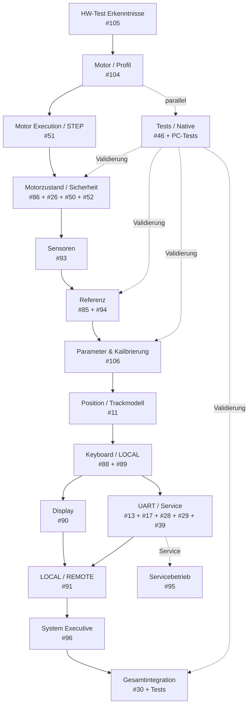

# FY Produktivsoftware – technische Roadmap

> Arbeitsdiagramm für die schrittweise Überführung der Erkenntnisse aus dem FY_HW_TEST in die Produktivsoftware.

## Arbeitsprinzip

1. Motor / Profil zuerst produktiv belastbar machen.
2. Darauf Motorzustand, Sensoren und Referenz aufbauen.
3. Danach Parameter-, Kalibrier- und Positionsmodell festlegen.
4. Keyboard, Display und UART auf dem stabilen Kern aufsetzen.
5. Servicefunktionen bewusst vom normalen Bedienablauf trennen.
6. Den System Executive erst einführen, wenn die darunterliegenden Module ausreichend stabil sind.
7. Tests parallel laufen lassen und die einzelnen Schritte begleiten.

## Regeln

- Der HW-Test-Code wird nicht kopiert.
- Übernommen werden bestätigte Anforderungen, Zustände, Abläufe, Parameter und technische Prinzipien.
- UART bleibt bei jedem Entwicklungsschritt funktionsfähig, damit der Nano weiterhin beobachtet und getestet werden kann.
- Referenzkompensation zunächst nicht erzwingen; die Architektur dafür bleibt offen.
- Parameter und EEPROM werden in #106 schrittweise klassifiziert.
- `response()` der Produktiv-UART wird im Zuge der UART-Überarbeitung konkretisiert.
- Neue Issues nur anlegen, wenn aus der Umsetzung tatsächlich eine Lücke entsteht.