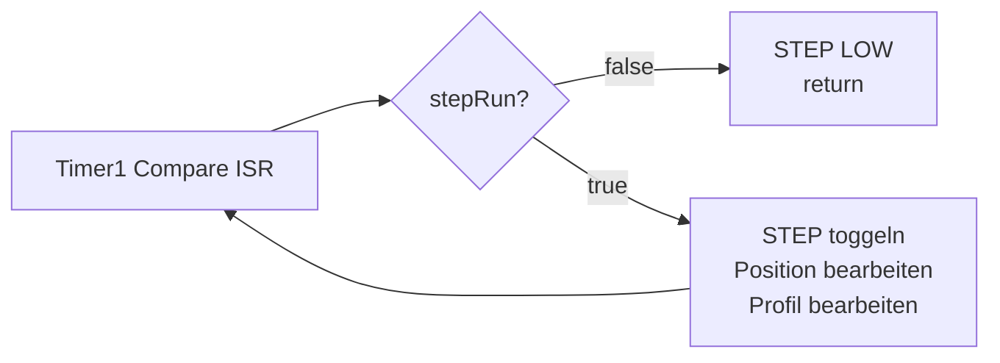
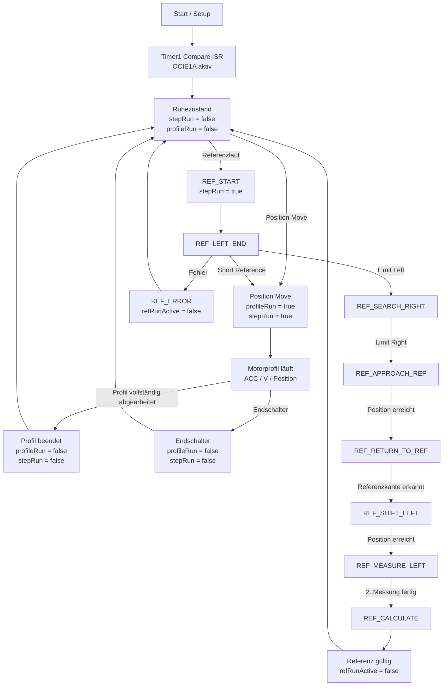
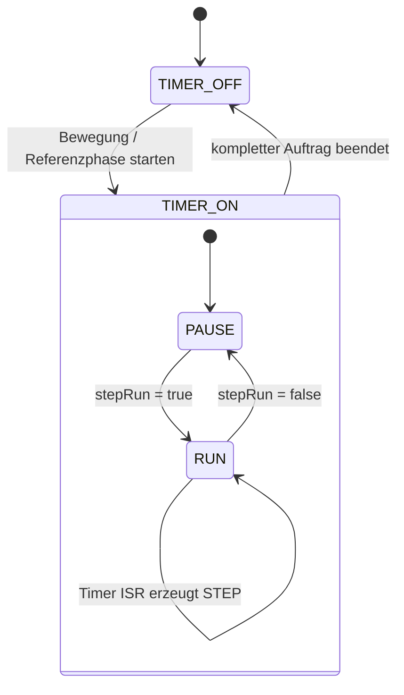

# ISR-Zustand – Motor

## Zweck

Dieses Dokument beschreibt den aktuellen Zustand von Timer1, `stepRun`, `profileRun` und dem Referenzlauf in `FY_HW_TEST`.

Es dient als Grundlage für die weitere Untersuchung des Motor- und Positionierverhaltens.

## Grundprinzip

Timer1 erzeugt aktuell dauerhaft Compare-Interrupts. Ob tatsächlich STEP-Pulse erzeugt werden, entscheidet `stepRun`.



Damit ist `stepRun=false` **nicht gleichbedeutend mit einem vollständig beendeten Auftrag**.

## Zustandsfluss



## Timer-Zustand und Bewegungszustand

Für die weitere Architektur sollten zwei Dinge getrennt betrachtet werden:



### Bedeutung

| Zustand | Bedeutung |
|---|---|
| Timer OFF | Timer1 Compare-Interrupt deaktiviert |
| Timer ON + `stepRun=false` | ISR läuft, erzeugt aber keine Schritte |
| Timer ON + `stepRun=true` | Motor kann Schritte erzeugen |
| Timer OFF nach Auftrag | kompletter Bewegungs-/Referenzauftrag beendet |

## Wichtige Beobachtung

Der aktuelle Code aktiviert in `init_step_timer()` dauerhaft:

```cpp
TIMSK1 |= _BV(OCIE1A);
```

Die ISR selbst verhindert bei `stepRun=false` weitere STEP-Flanken:

```cpp
if (!stepRun)
{
    stepLevel = false;
    PORTD &= ~_BV(PD3);
    return;
}
```

Bei einem normalen Positionierprofil wird am Ende außerdem:

```cpp
profileRun = false;
stepRun = false;
```

gesetzt.

**Daraus folgt:** Der dauerhaft aktivierte Timer ist nach aktuellem Codeverständnis nicht automatisch die Ursache für weitere Motor-Schritte. Er läuft jedoch unnötig weiter und ist vom eigentlichen Bewegungszustand getrennt.

## Konsequenz für die weitere Untersuchung

Der Timer-Interrupt sollte nicht einfach bei jedem

```cpp
stepRun = false;
```

deaktiviert werden.

Im Referenzlauf wird `stepRun=false` mehrfach nur als kurze Pause zwischen zwei Bewegungsphasen verwendet.

Sinnvoll wäre daher eine spätere Trennung von:

- **Timer1 aktiv/inaktiv**
- **`stepRun`**
- **`profileRun`**
- **`refRunActive` / `refRunState`**

Erst danach sollte entschieden werden, an welchen terminalen Zuständen der Timer tatsächlich abgeschaltet wird.

## Aktueller Stand

- Keine Änderung am Motorcode durch dieses Dokument.
- Diagramm beschreibt den aktuellen Stand und die daraus abgeleitete Zielstruktur.
- Die Frage nach einem möglichen ungewollten Weiterlaufen des Motors bleibt ein eigener Prüfschritt.
