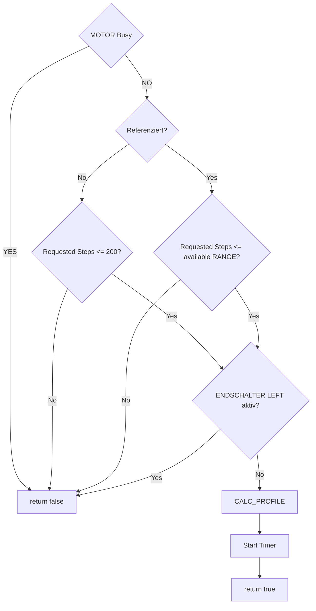

# MOTOR – Prepare LEFT Flow

Flow of the motor preparation logic for a LEFT movement.

The flow is intentionally used as a **coding guide**: it defines the decision order and makes safety/definition gaps visible before implementation.

`MOTOR_PrepaireRight.md` is intended to follow the same logic, mirrored for the RIGHT direction.

The diagrams are also intended as a basis for visualizing the reference run later and for identifying missing or ambiguous definitions before coding.