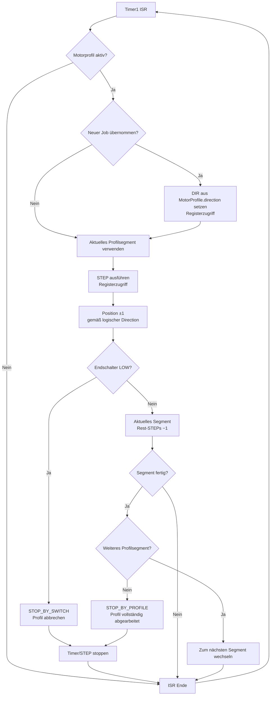

# Motor ISR – Profil-Executor

> Dokumentation der aktuellen Timer1-ISR-Ausführung.  
> Zugehöriges GitHub Issue: #51 – M7 Timer1 / STEP-Erzeugung, ISR und Motor-Execution.

## Grundprinzip

Die Timer1-ISR arbeitet ein **bereits vorbereitetes MotorProfile** ab.

Die Prepare-Funktionen erzeugen:
- die logische Fahrtrichtung
- die Profiltabelle mit den sechs Segmenten

Die ISR berechnet **kein neues Bewegungsprofil**. Sie führt die Profiltabelle Schritt für Schritt aus.

Die Abarbeitung endet, sobald:
1. das Profil vollständig abgearbeitet ist oder
2. ein Endschalter auslöst.

## Ablauf



## Profiltabelle und Segmentwechsel

Die Profiltabelle wird außerhalb der ISR vorbereitet:

```text
MotorProfile
├── direction
└── profile[]
    ├── ACC1
    ├── ACC2
    ├── KONST
    ├── BRE1
    ├── BRE2
    └── POSI
```

Die ISR hält den aktuellen Segmentzustand und arbeitet die dort vorgegebene Anzahl von STEP-Intervallen ab.

Nach dem letzten STEP eines Segments:
- Rest-STEPs werden aktualisiert,
- falls weitere Segmente vorhanden sind, wird auf das nächste Segment gewechselt,
- andernfalls wird `STOP_BY_PROFILE` gesetzt und die Bewegung beendet.

## Endschalter

- Endschalter werden nach jedem ausgeführten STEP geprüft.
- Aktiv ist der Zustand `LOW`.
- Ein Endschalter ist zunächst ein **physischer Bewegungsstopp**, nicht automatisch ein Fehler.
- Wird der Endschalter vor dem Profilende erreicht: `STOP_BY_SWITCH`.
- Wird der Endschalter auf dem letzten STEP gleichzeitig mit dem Profilende erreicht, hat `STOP_BY_PROFILE` Priorität.

## Zuständigkeiten

### Prepare-Funktionen
- Ziel und Bewegungsrichtung bestimmen
- `MotorProfile.direction` setzen
- Profiltabelle erzeugen
- Bewegung vorbereiten

### Timer1-ISR
- neuen vorbereiteten Job übernehmen
- physische DIR setzen
- STEP erzeugen
- Position fortschreiben
- Endschalter prüfen
- aktuelles Profilsegment abarbeiten
- Segmentwechsel durchführen
- bei Profilende oder Endschalter sicher stoppen

### Außerhalb der ISR
- UART / Kommunikation
- Anwendungsspezifische Fehlerinterpretation
- Entscheidung, ob `STOP_BY_SWITCH` im jeweiligen Kontext ein Fehler ist

## Hardwarezugriff

STEP und DIR werden im zeitkritischen Pfad direkt über Registerzugriffe bedient.

Die physische DIR-Polarität wird über `MOTOR_DIR_INVERTED` berücksichtigt.

Die Position wird anhand der **logischen Richtung** fortgeschrieben, nicht anhand des elektrischen DIR-Pinpegels.

## Referenzen

- GitHub Issue #51: M7 – Timer1 / STEP-Erzeugung, ISR und Motor-Execution
- Prepare-Funktionen: #24, #75, #76
- Profilberechnung: #23
- Motor Status/Position: #52
