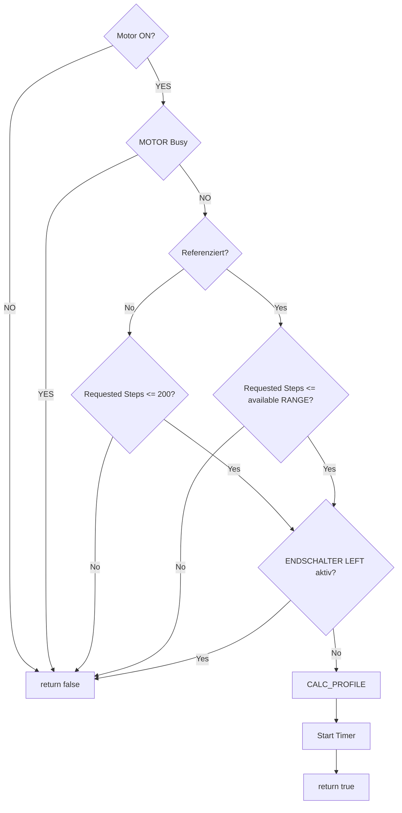

# MOTOR – Prepare LEFT Flow

Flow of the motor preparation logic for a LEFT movement.

The flow is intentionally used as a **coding guide**: it defines the decision order and makes safety/definition gaps visible before implementation.

The **first check is always the logical motor power state**. If the motor is OFF, no movement profile is prepared. The motor power state is tracked separately from the reference state; see **#86 – Motor Enable / Disable und Referenzverlust**.

`PrepareRight.md` soll sinngemäß gespiegelt folgen.

Die Diagramme dienen außerdem als Grundlage für die Visualisierung des Reference-Runs und machen fehlende oder noch nicht eindeutig definierte Entscheidungen vor dem Coding sichtbar.
