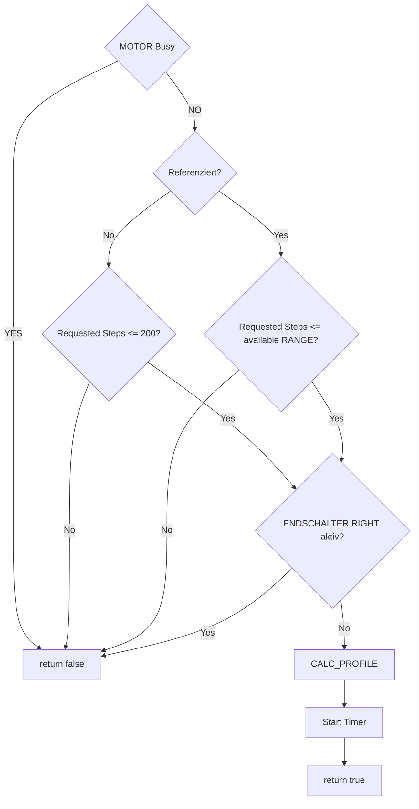

# MOTOR – Prepare RIGHT Flow

Flow of the motor preparation logic for a RIGHT movement.

The flow mirrors the LEFT preparation logic in the opposite direction.

Die LEFT- und RIGHT-Flows sind bewusst gespiegelt, damit die Richtungslogik beim Coding eindeutig bleibt.
