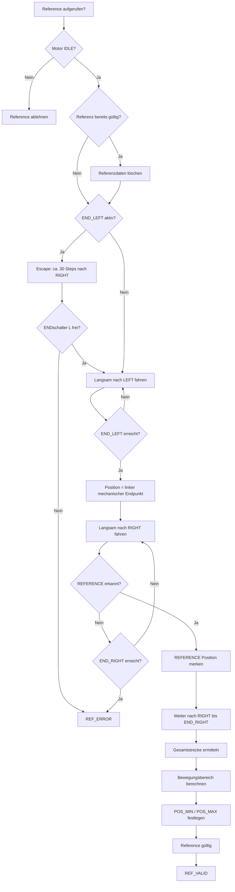

# MOTOR – PREFRUN first version

Erstes Diagramm für den Reference-Run.

Der Flow ist bewusst eine erste Version. Offene Detailentscheidungen bleiben sichtbar und werden vor der Implementierung geklärt.

## Offen

- Abbruch rechts, wenn der Endschalter nicht innerhalb der mathematisch erwarteten Maximalstrecke gefunden wird.
- Schleife für das Erkennen der Referenzfahne: `LOW / HIGH / LOW`.
- Speichern der Breite der Referenzfahne in Steps.
