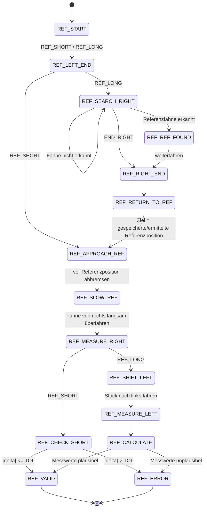

# Reference Run – State Machine

Die Referenzfahrt verwendet **eine gemeinsame State Machine**. Der Aufrufparameter `REF_SHORT` bzw. `REF_LONG` bestimmt, ob eine kurze Betriebsreferenzierung oder eine vollständige Kalibrier-/Messfahrt ausgeführt wird.

Die langsame präzise Referenzanfahrt ist bewusst ein gemeinsamer Zustand.

## Gemeinsame Zustände

- `REF_LEFT_END`: bis zum linken mechanischen Endanschlag fahren.
- `REF_APPROACH_REF`: anhand der erwarteten Referenzposition zur Fahne fahren.
- `REF_SLOW_REF`: abbremsen und auf langsame Positionsgeschwindigkeit wechseln.
- `REF_MEASURE_RIGHT`: präzise Referenzmessung aus einer Richtung.
- `REF_VALID` / `REF_ERROR`: eindeutiges Ergebnis.

## Lange Referenzierung

`REF_LONG` führt zusätzlich über:

`REF_SEARCH_RIGHT → REF_REF_FOUND → REF_RIGHT_END → REF_RETURN_TO_REF`

und misst anschließend die Referenzfahne nochmals langsam aus beiden Richtungen.

## Kurze Referenzierung

`REF_SHORT` springt nach `REF_LEFT_END` direkt in den gemeinsamen Pfad:

`REF_APPROACH_REF → REF_SLOW_REF → REF_MEASURE_RIGHT → REF_CHECK_SHORT`

Die gespeicherte Referenzposition ist dabei der Erwartungswert. Die aktuell gemessene Position wird mit diesem Wert verglichen.

## Sicherheitsgrenzen

Suchfahrten werden zusätzlich durch maximale Schrittzahl und maximale Fahrzeit begrenzt. Diese Grenzen sind Sicherheits-/Fehlerkriterien und ersetzen nicht die normalen Sensorzustände.
