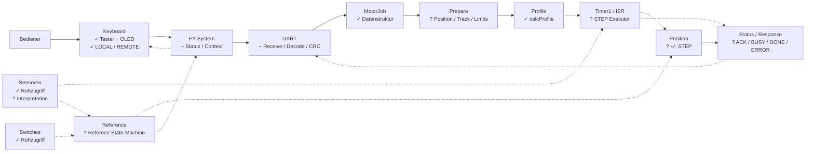
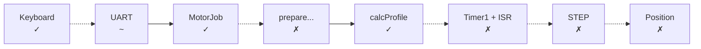

# FY UVB – Projektstatus

**Stand: 22.09.2026**

## 1. Kurzfassung

Das Projekt hat inzwischen eine recht klare Grundarchitektur:

* **Motor** – Kern der Bewegungssteuerung
* **UART** – Remote-Kommunikation
* **Keyboard** – lokale Bedienung + OLED
* **Switches** – Rohzugriff auf Sensoren
* **System** – übergreifender Zustand und Integration
* **Reference** – fachlich definiert, technisch aber noch nicht umgesetzt
* **Tests** – vorhanden, aber bisher hauptsächlich für die Profilberechnung
* **Dokumentation** – erste Mermaid-Diagramme und Systemdokumente vorhanden

Der auffälligste Punkt ist:

> **Die einzelnen Module sind weiter entwickelt als ihre Integration.**

Das ist für den jetzigen Projektstand sogar sinnvoll. Wir haben damit bereits Bausteine, die man einzeln bearbeiten kann.

---

# 2. Status nach Modul

| Bereich                           |  Issue beschrieben |                 Code vorhanden | Integrationsstand |
| --------------------------------- | -----------------: | -----------------------------: | ----------------: |
| Motor-Grundstruktur               |                  ✓ |                              ✓ |                🟡 |
| Fahrprofil                        |                  ✓ |                              ✓ |                🟢 |
| Motor `setJob()`                  |                  ✓ |                              ✓ |                🟡 |
| Motor State Machine               |                  ✓ |                      teilweise |                🔴 |
| Timer1 / STEP / ISR               |                  ✓ | vorbereitet, aber nicht fertig |                🔴 |
| Positionierung                    |                  ✓ |               überwiegend Stub |                🔴 |
| Referenzfahrt                     |                  ✓ |   State vorhanden, Logik fehlt |                🔴 |
| Motor Enable / Reference validity |                  ✓ |              Konzept vorhanden |                🔴 |
| UART Empfang                      |                  ✓ |                              ✓ |                🟡 |
| UART CRC                          |                  ✓ |         vorhanden, RX optional |                🟡 |
| UART → Motor                      |                  ✓ |                      teilweise |                🟡 |
| UART ACK/BUSY/DONE                |                  ✓ |              noch nicht fertig |                🔴 |
| Keyboard Architektur              |                  ✓ |                              ✓ |                🟢 |
| Taster                            |                  ✓ |                              ✓ |                🟢 |
| OLED                              |                  ✓ |                              ✓ |                🟢 |
| LOCAL/REMOTE                      |                  ✓ |              Zustand vorhanden |                🟡 |
| Keyboard → Motor/System           |                  ✓ |                     noch nicht |                🔴 |
| Switches Rohklasse                |                  ✓ |                              ✓ |                🟡 |
| Switches → Motor ISR              | fachlich notwendig |                     noch offen |                🔴 |
| POR / Startablauf                 |                  ✓ |                     noch nicht |                🔴 |
| Step-Servicebetrieb               |                  ✓ |                     noch nicht |                 ⚪ |
| Systemintegration                 |                  ✓ |                      teilweise |                🔴 |
| Unit-/Modultests                  |                  ✓ |                      teilweise |                🔴 |
| Dokumentation                     |                  ✓ |                      teilweise |                🟡 |

---

# 3. Was tatsächlich schon im Code steckt

## 🟢 Keyboard

Das ist inzwischen erstaunlich weit.

Vorhanden:

* 4 Taster
* PCF8574-Anbindung
* Zuordnung der Taster
* 50-ms-Entprellung
* Flankenerkennung
* STOP mit Priorität
* OLED 128×64
* Page-Buffer
* LOCAL/REMOTE
* TRACK-Anzeige
* READY/MOVING
* ERROR/E##
* I²C-Erkennung
* `is_connected()`
* Diagnosefeld für letzten Command vorbereitet

Damit ist das **Keyboard kein Konzept mehr**, sondern ein echter Codebaustein.

Was noch fehlt:

* tatsächliche Verbindung der Events mit der Systemlogik
* POR-Anzeige
* Referenzlauf-Anzeige
* LED-Zustandssteuerung als Teil des Ablaufs
* LOCAL/REMOTE tatsächlich systemweit schalten
* Diagnoseanzeige

---

# 4. 🟡 Switches

Die Rohklasse existiert.

Sie kann:

```text
REF
TRIM_LEFT
TRIM_RIGHT
TIMING_BELT
```

adressieren und digitale Rohwerte lesen.

Analog ist bereits berücksichtigt:

```text
kein Analogkanal → 0xFF
```

Das ist genau die richtige Größenordnung für diesen Schritt.

Aber:

> Die Switches wissen momentan noch nicht, **was ein Referenzsensor oder Endschalter bedeutet**.

Das ist gut.

Die Interpretation gehört in die Referenz-/Motorlogik.

---

# 5. 🟢 Motor – was schon real ist

Der Motor hat bereits eine brauchbare Grundstruktur.

Vorhanden:

```text
Motor
 ├── begin()
 ├── setJob()
 ├── Update()
 ├── Stop()
 ├── Emergency_break()
 ├── Reference()
 ├── move2Pos()
 ├── moveSteps()
 ├── calcProfile()
 └── Status-/Positionszugriff
```

### Besonders wichtig

`calcProfile()` ist nicht mehr nur Papier.

Es gibt bereits einen echten Test:

```text
distance
   ↓
ACC1
ACC2
KONST
BRE1
BRE2
POSI
   ↓
Summe == distance
```

und die Symmetrien werden geprüft.

Das ist unser erster echter **grüner Kernbereich**.

---

# 6. 🔴 Motor – was noch fehlt

Hier liegt momentan der größte Block.

Die Methoden existieren teilweise nur als Gerüst:

```text
move2Pos()
moveSteps()
Reference()
prepareLeft()
prepareRight()
prepareSetTrack()
prepareSetPosition()
prepareParameter()
CheckBorder()
```

Die State Machine ist ebenfalls noch nicht ausführbar.

Noch fehlen insbesondere:

### Bewegung

```text
Job
 ↓
prepare
 ↓
calcProfile
 ↓
Timer1
 ↓
STEP
 ↓
Position
 ↓
Target erreicht
 ↓
DONE
```

### Timer1

Der Timer ist vorbereitet, aber der eigentliche vollständige Executor fehlt.

### Position

Die Position muss bei jedem gültigen STEP richtungsabhängig verändert werden.

Und genau hier kommen wir zu deinem aktuellen Gedankenproblem:

> **ISR und Switches dürfen nicht einfach zwei unterschiedliche Hardwarewelten bedienen.**

Das ist tatsächlich ein Architekturpunkt, den wir vor dem nächsten großen Motor-Schritt sauber entscheiden sollten.

---

# 7. 🔴 Referenzfahrt

Die fachliche Beschreibung ist inzwischen ziemlich gut.

Wir wissen:

```text
POR
 ↓
LOCAL
 ↓
Start
 ↓
ENABLE
 ↓
Endlage links
 ↓
Endlage rechts
 ↓
Referenzfahne
 ↓
Messwerte
 ↓
REF_VALID
```

Auch das Koordinatensystem ist grundsätzlich beschrieben.

Aber die eigentliche Referenz-State-Machine fehlt noch.

Das bedeutet:

**Die Spezifikation ist deutlich weiter als die Implementierung.**

Das ist momentan vermutlich die größte Differenz im gesamten Projekt.

---

# 8. 🟡 UART

UART ist ebenfalls deutlich weiter als nur ein Stub.

Vorhanden:

* 115200 Baud
* Empfangs-State-Machine
* Command-Erkennung
* Command-Längen
* CRC-Funktion
* optionaler CRC-RX
* Response Buffer
* `Hello my friend`
* Command Dispatcher
* MotorJob-Erzeugung
* UART → Motor `setJob()`

Das ist schon ein ordentliches Fundament.

Aber:

```text
UART
 ↓
Command
 ↓
Motor
```

ist noch nicht vollständig rückgekoppelt.

Es fehlen insbesondere:

```text
Motor
 ↓
Status
 ↓
UART
 ↓
ACK / BUSY / DONE / ERROR
```

sowie die endgültige Semantik von:

* ACK
* BUSY
* DONE
* ResponsePending
* Fehlerantworten
* Kommunikationsverlust

---

# 9. 🔴 Systemintegration

Hier sitzt momentan der eigentliche Engpass.

`main.cpp` kennt bereits:

```text
UART
Motor
Keyboard
```

und der `FY_ModuleContext` verbindet sie.

Aber der zyklische Ablauf ist noch nicht zusammengebaut.

Aktuell läuft im Wesentlichen:

```text
loop()
  ↓
UART.update()
```

Während Dinge wie

```text
Motor.Update()
Keyboard.update()
Switches...
System-State...
```

noch nicht sauber in einem gemeinsamen Zyklus laufen.

Das erklärt auch, warum wir trotz vieler fertiger Bausteine noch nicht sagen können:

> „Jetzt funktioniert der komplette Controller.“

---

# 10. 🔴 POR

Das neue Issue #94 beschreibt inzwischen einen ziemlich vollständigen Ablauf:

```text
Power On
 ↓
LOCAL
 ↓
Begrüßung
 ↓
5 s
 ↓
"Taster Grün für Start"
 ↓
Grün
 ↓
ENABLE
 ↓
Referenzlauf
 ↓
Rot EIN
 ↓
Referenzschritte anzeigen
 ↓
Ergebnis anzeigen
 ↓
Grün quittiert
 ↓
Step / Track auswählen
```

Das ist jetzt eine **System-Spezifikation**.

Im Code ist davon bisher nur ein Teil der dafür benötigten Komponenten vorhanden.

Das ist genau der richtige nächste Integrationsblock — aber erst nachdem Motor/Referenz technisch fahrfähig sind.

---

# 11. 🔴 Tests

Hier sieht man einen interessanten Unterschied zwischen Issue-Struktur und Realität.

Beschrieben sind Tests für:

* Motor-Grundinitialisierung
* `setJob()`
* Bewegungsaufträge
* State Machine
* Timer1
* Status/Position
* UART
* UART → Motor
* Systemintegration

Tatsächlich gefunden habe ich derzeit als konkreten Motor-Test insbesondere:

```text
test_calcProfile.cpp
```

Der ist sinnvoll und prüft echte Eigenschaften.

Aber der große Rest der Teststruktur ist noch **geplant, nicht umgesetzt**.

Das ist ein wichtiger Punkt für unseren Status:

> **Die Test-Issues sind bereits detaillierter als die vorhandene Testimplementierung.**

---

# 12. Der eigentliche Projektfluss

Und jetzt die etwas wildere Darstellung.

**Legende:**

* 🟢 durchgezogene Linie = im Code bereits verbunden
* 🟡 gestrichelte Linie = fachlich vorgesehen, aber noch nicht vollständig implementiert
* Kästchen mit `~` = teilweise implementiert
* Kästchen mit `?` = noch offen



---

# 13. Noch besser: der Weg zu „erste echte Bewegung“

Wenn wir das Diagramm auf den **kleinsten sinnvollen nächsten Meilenstein** reduzieren, sieht es so aus:



Und daraus ergibt sich für mich ziemlich klar:

## Der nächste technische Engpass ist nicht Keyboard.

Auch nicht UART.

Auch nicht noch eine weitere Abstraktion.

**Der nächste Engpass ist:**

```text
MotorJob
   ↓
prepare
   ↓
calcProfile
   ↓
Timer1
   ↓
STEP
   ↓
Positionszähler
```

Und **parallel dazu müssen wir die ISR ↔ Switches-Frage klären**, bevor wir die Endschalter dort hineinhängen.

---

# 14. Was uns auf Projektebene noch fehlt

Ich würde momentan sieben große offene Blöcke sehen:

### ① Motor wirklich fahren lassen 🔴

`prepare → profile → Timer1 → STEP`

### ② Positionszählung 🔴

Richtung + STEP → `_Position`

### ③ Sensorzugriff für ISR/Endschalter 🔴

Hier genau deine aktuelle Architekturfrage.

### ④ Referenzfahrt 🔴

Die inzwischen sehr gut beschriebene State Machine muss implementiert werden.

### ⑤ Systemzyklus 🔴

```text
Keyboard
UART
Motor
Switches
System
```

müssen tatsächlich gemeinsam laufen.

### ⑥ Rückmeldung 🔴

```text
Motor/System
 ↓
Status
 ↓
UART
 ↓
Remote
```

### ⑦ Teststrecke 🟡 → 🔴

Erst Modultests, dann:

```text
Motor
 ↓
Hardware
 ↓
erste Bewegung
 ↓
Referenz
 ↓
Track
 ↓
STOP / Emergency
 ↓
POR
```

---

# 15. Und was ich ausdrücklich NICHT als „noch fehlt“ zählen würde

Ein paar Dinge sehen in den Issues größer aus, als sie für den nächsten Schritt tatsächlich sind:

* Step-Servicebetrieb #95 → **später**
* Bewegungsanimation → **später**
* Diagnosebildschirm → **später**
* perfekte Dokumentation → **später**
* CRC-Feinschliff → wichtig, aber nicht vor der ersten Bewegung
* BELT_SENSOR → später
* umfangreiche Menülogik → brauchen wir wahrscheinlich überhaupt nicht
* weitere Abstraktionsschichten → bitte nicht 😁

---

# 16. Der innere Monk bekommt damit ein ziemlich klares Bild

Wir haben derzeit ungefähr:

```text
             SPEZIFIKATION
                  ███████████████████
                  █████████████████
                  ███████████████

             CODE-BASIS
                  ███████████████
                  █████████████
                  ███████████

             INTEGRATION
                  ███████
                  █████
                  ███

             HARDWARE-LAUF
                  ███
                  ██
                  █
```

Das bedeutet nicht, dass wir „hinterherhinken“.

Es bedeutet:

> **Wir haben inzwischen genug Architektur und Code definiert, dass der nächste große Schritt nicht mehr Design ist, sondern das Zusammenschalten und reale Laufenlassen.**

Und genau deshalb ist die aktuelle Frage **ISR ↔ Switches** gerade ziemlich wertvoll. Das ist keine Nebensache mehr, sondern eine der letzten Architekturentscheidungen, bevor aus einzelnen Codebausteinen langsam ein echter FY-Controller wird.
