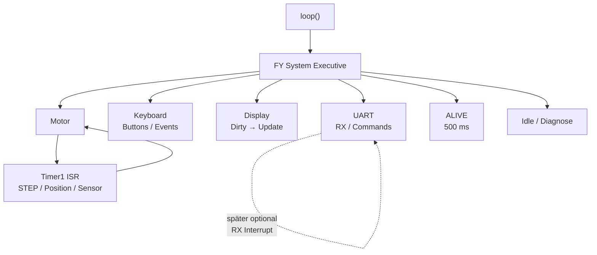
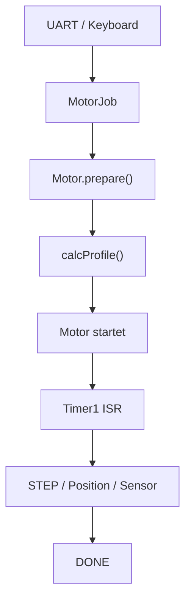
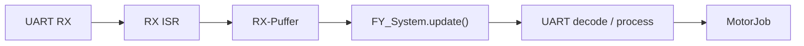
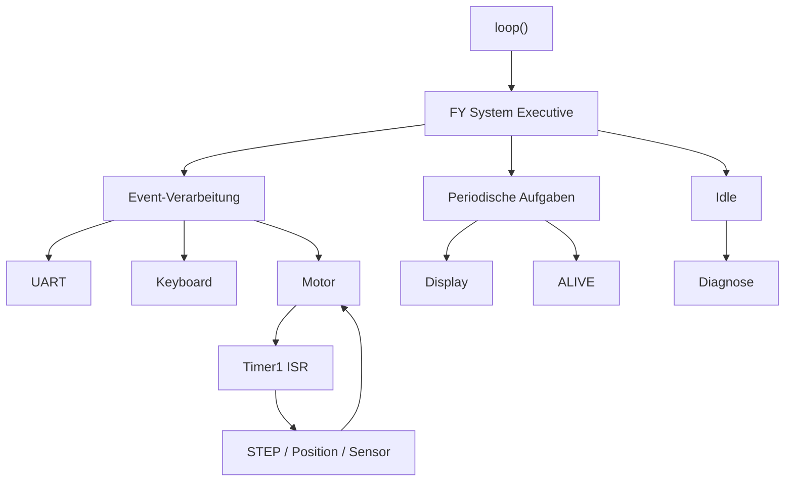

# FY System Executive – Mini-Scheduler

> **Arbeitsdokument / Architektur**
>
> Das FY System Executive ist bewusst kein RTOS und kein allgemeines Betriebssystem.
> Es ist eine kleine, auf den Fiddle Yard UVB zugeschnittene Ablaufsteuerung.

Parent Issue: #42 System  
Child Issue: #96 SYS – FY System Executive / Mini-Scheduler

## 1. Grundidee

Der Arduino-Loop soll nicht selbst verstreute Ablaufsteuerung enthalten.

Zentraler Einstieg:

```cpp
void loop()
{
    FY_System.update();
}
```

Das Executive verteilt die vorhandene Zeit auf wenige klar definierte Aufgaben.

## 2. Ausführungsklassen

| Klasse | Beispiele | Mechanismus |
|---|---|---|
| ⚡ Echtzeit | STEP, Position, unmittelbare Sensorreaktion | Timer1 ISR |
| 🔄 Event | UART-Kommandos, MotorJob, STOP | System-/Loop-Kontext |
| ⏱️ Periodisch | Taster, Display, ALIVE | `millis()` |
| 💤 Hintergrund | Diagnose, optionale Pflegearbeiten | Idle |

## 3. Gesamtarchitektur



**Lesart:**

- Durchgezogene Verbindungen = normaler Ablauf im System.
- Gestrichelte Verbindung = bewusst nur als spätere Erweiterung vorgesehen.
- Timer1/ISR ist vom normalen Systemzyklus getrennt.

## 4. Motorablauf



Der normale Systemzyklus startet und überwacht die Motorlogik nur dort, wo dies außerhalb der Echtzeit-Ausführung erforderlich ist.

Der eigentliche Bewegungsablauf läuft nach dem Start über Timer1.

`Motor.update()` darf im Idle-Fall sehr billig sein und sofort zurückkehren.

## 5. Zeitbasis

Die periodischen Aufgaben verwenden eine gemeinsame `millis()`-Zeitbasis.

Richtwerte:

| Aufgabe | Zielintervall |
|---|---:|
| Keyboard | ca. 10–20 ms |
| Display-Prüfung | ca. 100 ms |
| ALIVE | ca. 500 ms |
| Diagnose / Hintergrund | ca. 1000 ms |

Die Werte sind keine harte Echtzeit-Spezifikation und können später angepasst werden.

Es gibt **keine blockierenden `delay()`-Aufrufe** im normalen Ablauf.

## 6. UART

Der aktuelle UART bleibt zunächst gepollt.

Die Architektur wird trotzdem so gehalten, dass später optional ein RX-Interrupt ergänzt werden kann:



Der RX-Interrupt darf ausschließlich empfangene Bytes sicher in einen Puffer übernehmen.

**Nicht im RX-ISR:**

- Command-Ausführung
- Motorsteuerung
- Display-Aktualisierung
- komplexe Zustandslogik

ALIVE ist eine unabhängige periodische Systemaufgabe und hängt nicht am RX-Interrupt.

## 7. Keyboard und Display

### Keyboard

- nicht blockierend
- zyklische Abfrage
- vorhandene 50-ms-Entprellung bleibt erhalten
- STOP wird zuerst behandelt

### Display

Das Display arbeitet mit einem Dirty-Prinzip.

Nicht:

```
loop → immer Display neu zeichnen
```

sondern:

```
Statusänderung
    ↓
Display dirty
    ↓
periodische Prüfung
    ↓
Display aktualisieren
    ↓
dirty = false
```

Damit wird das OLED nicht unnötig ständig neu aufgebaut.

## 8. Switches und Sensoren

Die bereits getroffene Architekturentscheidung:

- Im normalen Main-/Loop-Kontext sind `digitalRead()` und `analogRead()` zulässig.
- Im Timer1-ISR-Kontext werden zeitkritische Signale direkt über AVR-Register gelesen.
- Der ISR-Code bleibt minimal und deterministisch.
- Sensorinterpretation erfolgt außerhalb der ISR, sofern keine unmittelbare Echtzeitreaktion erforderlich ist.
- Für die vorhandenen LM393-Gabelsensoren wird zunächst keine zusätzliche Filter-/Debounce-Logik im ISR vorgesehen.

Details siehe Issue #93.

## 9. Idle

Wenn keine dringende Arbeit anliegt, darf ein einfacher Idle-/Diagnose-Slot ausgeführt werden.

Der Idle-Slot ist ausdrücklich **kein zweiter Scheduler**.

Es gibt:

- keine Task-Objekte
- keine Threads
- keine Prioritätsverwaltung
- keine Semaphore/Mutex
- keine komplexen Message Queues
- keine dynamische Speicherverwaltung

## 10. Was dieses „FY-OS“ ausdrücklich nicht ist

Das System Executive ist kein OSEK/RTOS.

Der Begriff „OS“ beschreibt hier nur die Rolle als zentraler Ablaufverwalter.

Ziel ist:

> **So viel Systemsteuerung wie nötig – so wenig Framework wie möglich.**

## 11. Geplanter Aufbau

Kleinste sinnvolle Umsetzung:

1. `FY_System.update()` als zentralen Zyklus einführen.
2. Gemeinsame `millis()`-Zeitbasis ergänzen.
3. UART und Keyboard als Event-Quellen einbinden.
4. Display-Dirty-Prinzip anbinden.
5. ALIVE als periodische Aufgabe ergänzen.
6. MotorJob/Motorzustand anbinden.
7. Idle/Diagnose als letzten optionalen Slot ergänzen.
8. Erst danach prüfen, ob ein UART-RX-Interrupt überhaupt erforderlich ist.

## 12. Zielbild



Damit entsteht eine klare Trennung:

**System Executive organisiert – Timer1 führt Echtzeit aus – Module machen ihre eigentliche Arbeit.**

## 13. Status

🟢 **Architektur entschieden**

🟡 **Implementierung offen**

⚪ **UART-RX-Interrupt bewusst später**

⚪ **Idle zunächst optional**

Die Datei beschreibt den aktuellen Architekturstand und darf sich mit der Implementierung weiterentwickeln.
