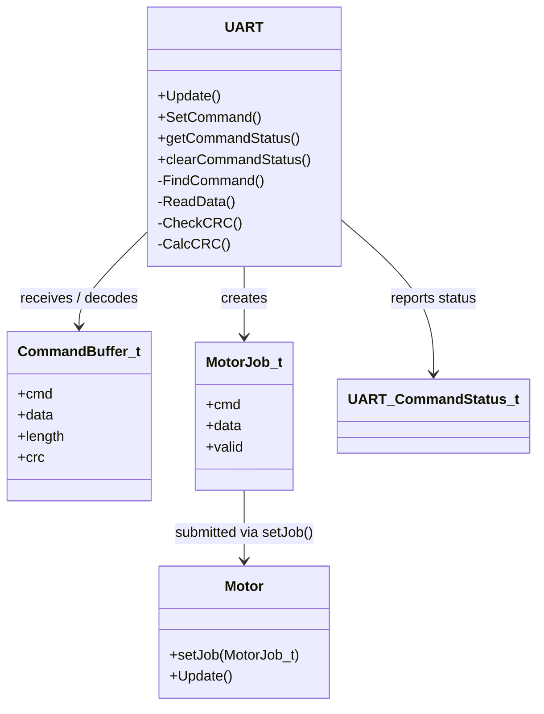

# UART – Class Diagram

Architecture view of the UART module and its hand-off to the Motor module.

## Architectural rule

UART is responsible for transport and command decoding.
Motor is responsible for accepting and executing motor jobs.

The UART handlers stay thin. They dispatch the already validated command instead of containing motor-specific execution logic.
