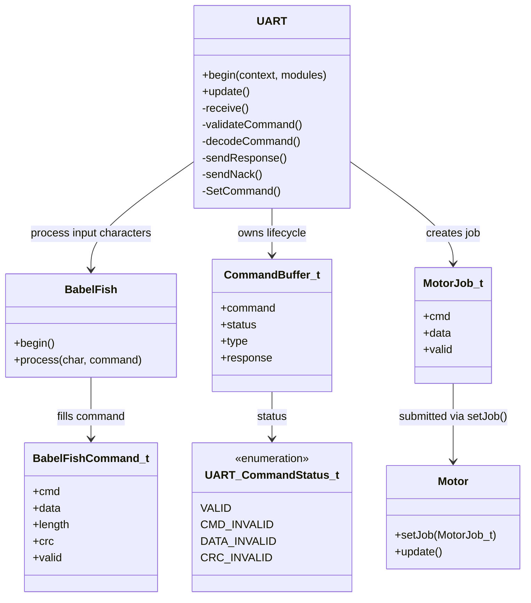
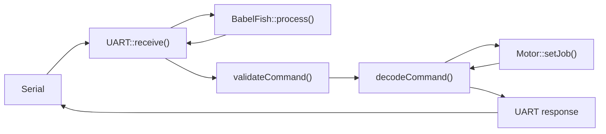

# UART – Class Diagram

Architecture view of the UART module, BabelFish and the hand-off to the Motor module.

```mermaid
classDiagram
    class UART {
        +begin(context, modules)
        +update()
        -receive()
        -validateCommand()
        -decodeCommand()
        -sendResponse()
        -sendNack()
        -SetCommand()
    }

    class BabelFish {
        +begin()
        +process(char, command)
    }

    class BabelFishCommand_t {
        +cmd
        +data
        +length
        +crc
        +valid
    }

    class UART_CommandStatus_t {
        <<enumeration>>
        VALID
        CMD_INVALID
        DATA_INVALID
        CRC_INVALID
    }

    class CommandBuffer_t {
        +command
        +status
        +type
        +response
    }

    class MotorJob_t {
        +cmd
        +data
        +valid
    }

    class Motor {
        +setJob(MotorJob_t)
        +update()
    }

    UART --> BabelFish : process input characters
    BabelFish --> BabelFishCommand_t : fills command
    UART --> CommandBuffer_t : owns lifecycle
    CommandBuffer_t --> UART_CommandStatus_t : status
    UART --> MotorJob_t : creates job
    MotorJob_t --> Motor : submitted via setJob()
```

## Responsibility boundary

```mermaid
flowchart LR
    S["Serial"] --> U["UART::receive()"]
    U --> B["BabelFish::process()"]
    B --> U
    U --> V["validateCommand()"]
    V --> D["decodeCommand()"]
    D --> M["Motor::setJob()"]
    M --> D
    D --> R["UART response"]
    R --> S
```

### Architectural rule

- **UART** owns Serial reception, command lifecycle, validation, dispatch and response transmission.
- **BabelFish** converts the human-readable ASCII command into the existing binary command structure and handles character echo.
- **Motor** accepts a validated MotorJob_t and owns motor-specific execution.
- There is no separate intermediate command class.

The UART handlers stay thin. Motor-specific execution logic does not move into UART.
