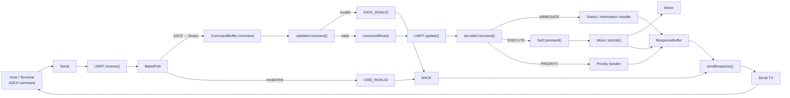
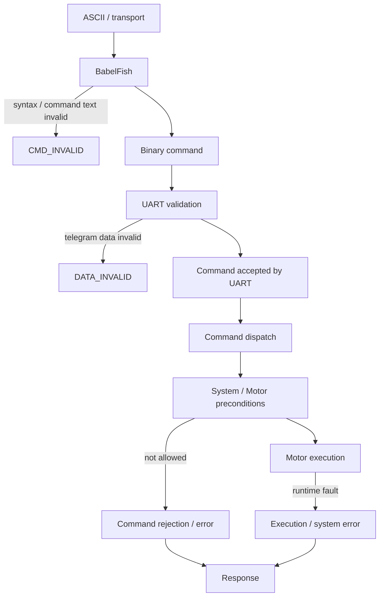
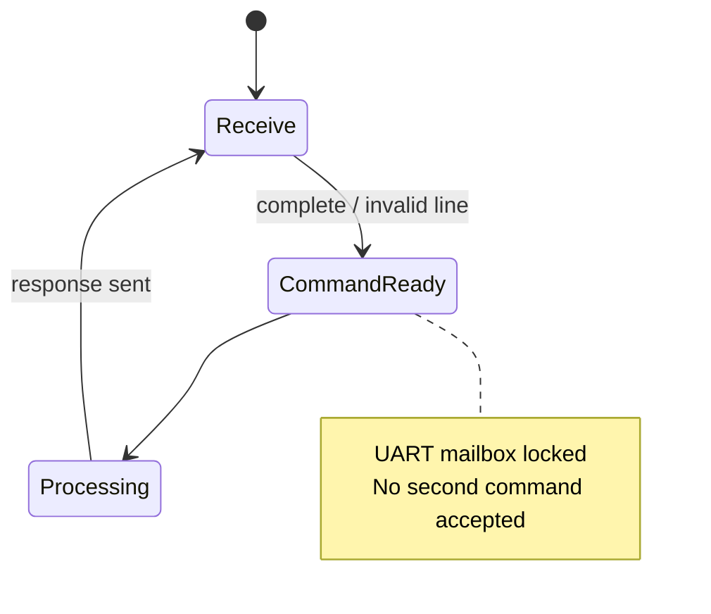

# UART – Information Flow

This document describes the information path through the productive UART architecture.

It is intentionally a **flow document**, not a second protocol specification. Command definitions remain in Protokoll.h; module behaviour remains in the respective modules.

## 1. End-to-end flow

## 2. Where errors belong

The important architectural distinction is:

- **BabelFish errors** concern the textual command representation.
- **UART validation errors** concern the decoded command and its telegram definition.
- **System / Motor errors** concern whether a valid command may be executed.
- **Execution errors** concern faults occurring after execution has started.

These categories can later be mapped to the system-wide error definitions without changing the information flow.

## 3. Command lifecycle

This lifecycle is deliberately independent of the Motor state.

**UART busy** means only that one command is currently owned by the UART command lifecycle. It is not the same as FY_SystemState_t::Busy or MotorState_t::MOVING.

## 4. Architectural invariants

1. UART::receive() is the single owner of Serial input.
2. BabelFish processes characters supplied by UART; it does not own Serial.
3. The existing CommandBuffer remains the command hand-off point.
4. commandReady prevents overwriting a command while it is being processed.
5. Invalid commands follow the same lifecycle and release the UART afterwards.
6. decodeCommand() dispatches; it does not become a second Motor implementation.
7. Motor-specific execution remains in the Motor module.
8. No additional intermediate command class is introduced.

## 5. Related documentation

- ReceiveFlow.md – character reception and command lifecycle
- SetCommandFlow.md – UART → Motor job hand-off
- ClassDiagram.md – module relationships
- ../System/ModuleStates.md – system and module states
- ../System/FY_System_Executive.md – overall system scheduling
