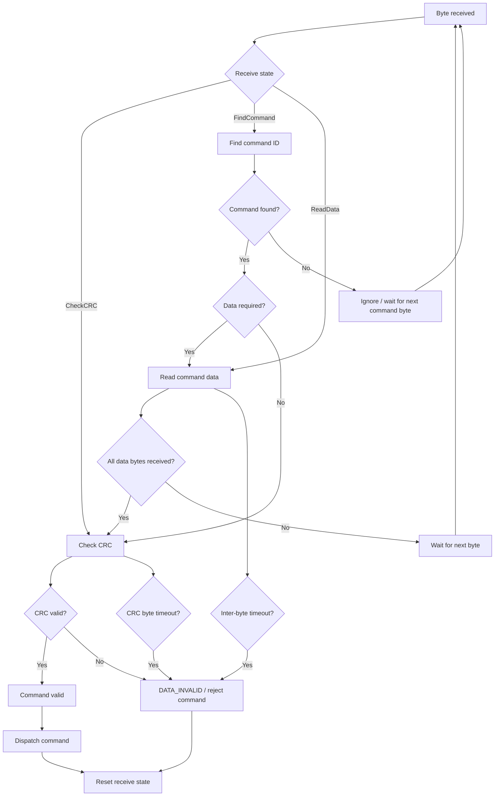

# UART – Receive Flow

Flow of the UART receive state machine.

## Timeout rule

The inter-byte timeout starts with the command byte and is refreshed for every received byte.

The timeout is derived from the configured UART baud rate. The current design uses a basis of 5 byte times (8N1: approximately 10 bit times per byte).

A timeout does not evaluate command semantics. It only protects the technical telegram reception.
