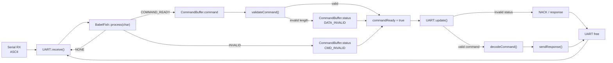
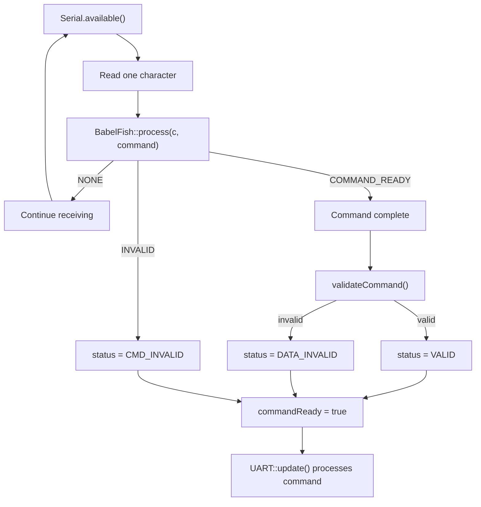
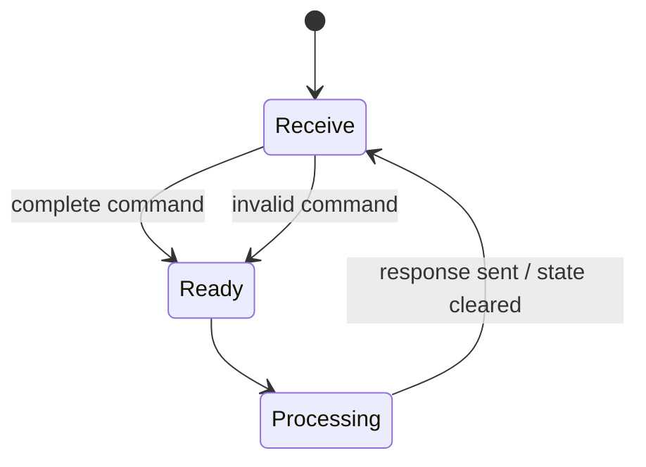
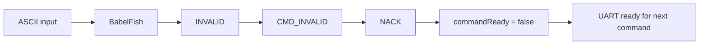

# UART – Receive Flow

The UART receive path has one clear responsibility:

> Receive one ASCII command, let BabelFish convert it into the binary command representation, validate it, and hand it to the existing UART command lifecycle.

UART remains the owner of the receive path and of the command mailbox. BabelFish does **not** own the Serial interface.

## 1. Information flow


```mermaid
flowchart LR
    RX["Serial RX<br/>ASCII"] --> R["UART::receive()"]
    R --> B["BabelFish::process(char)"]

    B -->|NONE| R
    B -->|COMMAND_READY| CB["CommandBuffer.command"]
    B -->|INVALID| CI["CommandBuffer.status<br/>CMD_INVALID"]

    CB --> V["validateCommand()"]
    V -->|valid| READY["commandReady = true"]
    V -->|invalid length| DI["CommandBuffer.status<br/>DATA_INVALID"]
    DI --> READY

    CI --> READY

    READY --> U["UART::update()"]
    U -->|invalid status| N["NACK / response"]
    U -->|valid command| D["decodeCommand()"]
    D --> RESP["sendResponse()"]

    N --> FREE["UART free"]
    RESP --> FREE
    FREE --> R
```

This diagram describes the current productive architecture. There is no additional intermediate command class or duplicate completed-command buffer.

## 2. Character-level receive flow


```mermaid
flowchart TD
    A["Serial.available()"] --> B["Read one character"]
    B --> C["BabelFish::process(c, command)"]

    C -->|NONE| D["Continue receiving"]
    D --> A

    C -->|COMMAND_READY| E["Command complete"]
    E --> F["validateCommand()"]
    F -->|valid| G["status = VALID"]
    F -->|invalid| H["status = DATA_INVALID"]
    G --> I["commandReady = true"]
    H --> I

    C -->|INVALID| J["status = CMD_INVALID"]
    J --> I

    I --> K["UART::update() processes command"]
```

Echo of ordinary ASCII input is handled by BabelFish while processing the character. Echo does not require a second command buffer.

## 3. Command lifecycle


```mermaid
stateDiagram-v2
    [*] --> Receive
    Receive --> Ready: complete command
    Receive --> Ready: invalid command
    Ready --> Processing
    Processing --> Receive: response sent / state cleared
```

commandReady is the UART-level lock.

While commandReady is true, receive() accepts no further command. This prevents a second command from overwriting the command currently being processed.

The lock is released after the response path has completed. An invalid command therefore cannot permanently block UART reception.

## 4. Invalid-command path


```mermaid
flowchart LR
    A["ASCII input"] --> B["BabelFish"]
    B --> C["INVALID"]
    C --> D["CMD_INVALID"]
    D --> E["NACK"]
    E --> F["commandReady = false"]
    F --> G["UART ready for next command"]
```

This behaviour was verified with:

```text
huhu
CMD_INVALID
<binary NACK>
status
CMD=0x19 LEN=1 CRC=0x19
<binary status response>
```

## 5. Responsibility boundary

| Responsibility | Module |
|---|---|
| Read Serial characters | UART |
| Echo input | BabelFish |
| ASCII → binary command | BabelFish |
| Command validation | UART |
| Command mailbox / lifecycle | UART |
| Command dispatch | UART |
| Motor job creation | UART |
| Motor job acceptance / execution | Motor |
| Response transmission | UART |

### Architectural rule

The receive path stays deliberately small:

**UART owns transport and lifecycle. BabelFish translates. UART validates and dispatches. Motor owns motor behaviour.**

No additional intermediate command layer is required.
