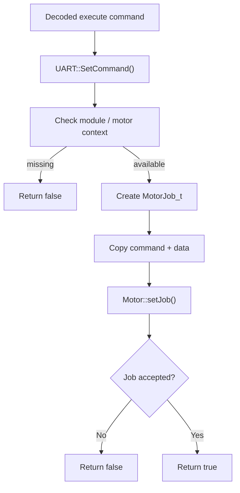
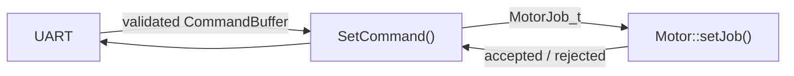

# UART – SetCommand(...) Flow

SetCommand() is the existing UART-to-Motor hand-off for commands that become MotorJob_t.

## Responsibility boundary

SetCommand() does not start the motor directly and does not inspect the internal motor profile or movement state. Those decisions belong to the Motor module.

### Important distinction

SetCommand() returning true means that the Motor module accepted the job.

It does **not** mean that physical movement has already completed.

The exact rejection reason and the system-wide error mapping are handled separately by the command/error architecture.
