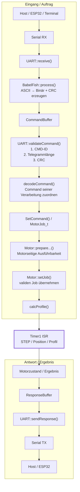

# UART / Motor – Signal Flow V-Model

Dieses Diagramm beschreibt den Signal- und Funktionsfluss der produktiven Firmware.
Es ist bewusst als wachsende Arbeitsdokumentation angelegt: Mit jedem abgeschlossenen
Arbeitsschritt wird der betreffende Abschnitt präzisiert.

Der Fußpunkt des V ist die Timer1-ISR. Links läuft der Eingang bis zur Ausführung
hinunter, rechts entsteht daraus wieder der Status-/Antwortweg nach oben.

## V-Modell

## Arbeitsprinzip

### Linke Seite – Eingang

Die linke Seite wird von oben nach unten schrittweise fertiggestellt:

1. UART-Empfang
2. BabelFish: ASCII → Binärtelegramm und CRC erzeugen; keine semantische Command-Validierung
3. `validateCommand()`: Command-ID, Telegrammlänge und CRC prüfen; später weitere formale Telegrammprüfungen
4. Command-Zuordnung und Behandlung
5. Motorvorbereitung
6. `setJob()`
7. Profilberechnung
8. ISR-Ausführung

### Fußpunkt – ISR

Die ISR ist der Ausführungskern des V:
- STEP erzeugen
- Position fortschreiben
- Profilsegment ausführen
- Endbedingungen erkennen

Die ISR entscheidet nicht über die Bedeutung eines UART-Kommandos.

### Rechte Seite – Antwort

Die rechte Seite wird aufgebaut, sobald Ausführung und Ergebnisse definiert sind:
- Motorzustand / Ergebnis
- Response-Daten
- `sendResponse()`
- Serial TX
- Rückmeldung an Host / ESP32

## Aktueller Arbeitsstand

| Abschnitt | Status |
|---|---|
| UART → BabelFish → CommandBuffer | erledigt |
| Command-Lifecycle / UART Busy | erledigt |
| Command-ID prüfen | vorhanden |
| Telegrammlänge prüfen | vorhanden |
| **CRC in `validateCommand()` prüfen** | **nächster Arbeitsschritt** |
| Command-Zuordnung / Behandlung | danach |
| MotorJob / Motor-Schnittstelle | danach |
| Profil / ISR-Anbindung | später |
| Antwortweg vollständig definieren | wird ergänzt |

## Dokumentationsregel

Dieses Diagramm ist keine zweite Protokollspezifikation. Die konkreten Command-Definitionen
bleiben in `Protokoll.h`, die Implementierung bleibt in den jeweiligen Modulen.

Das Diagramm dokumentiert ausschließlich:
- welche Funktion als Nächstes aufgerufen wird
- welche Aufgabe sie besitzt
- welche Daten dabei weitergegeben werden
- wo im V-Modell der aktuelle Entwicklungsstand liegt.

Bei längeren Unterbrechungen soll damit ohne erneutes Durcharbeiten des gesamten Codes
erkennbar sein, wo der Signalfluss zuletzt abgeschlossen wurde.