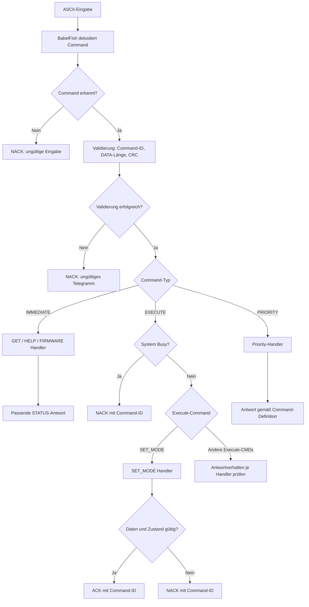
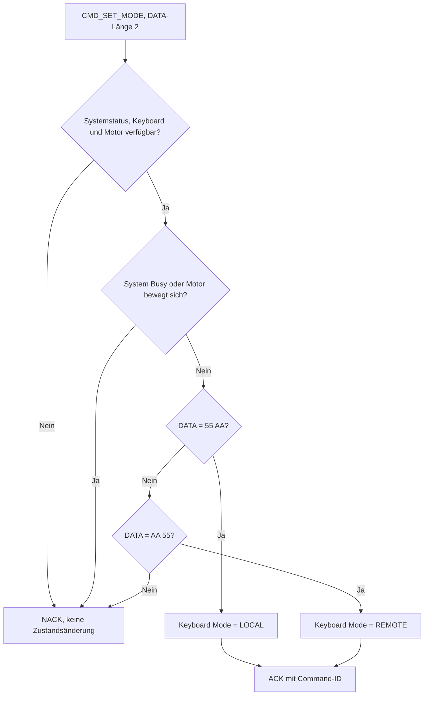

# UART Commands – Ablauf und Antwortbedingungen

Referenz für die Protokollabstimmung in [Issue #58](https://github.com/ErikaB-sys/Fiddle_yard_UVB/issues/58).
Die Übersicht unterscheidet bereits implementierte Antwortpfade von noch offenen Handlern.

## Zentrale Übersicht

## SET_MODE – Detailablauf

## SET_MODE – Bedingungen

| Bedingung | Antwort | Zustandsänderung |
|---|---|---|
| Erforderliches Modul fehlt | NACK | keine |
| System meldet Busy | NACK | keine |
| Motor bewegt sich | NACK | keine |
| DATA `55 AA` | ACK | Mode = LOCAL |
| DATA `AA 55` | ACK | Mode = REMOTE |
| Anderes DATA-Muster | NACK | keine |

- Command-ID: `CMD_SET_MODE = 0x26` (bisherige SET_LOCAL-ID weiterverwendet).
- DATA-Länge: 2 Byte.
- `CMD_SET_LOCAL` und `CMD_SET_REMOTE` entfallen; die alte ID `0x2A` wird nicht mehr verwendet.
- ACK (`0x60`) und NACK (`0x70`) enthalten jeweils die Command-ID als ein DATA-Byte; die CRC folgt wie üblich.
- SET_MODE schaltet den Motor nicht ein und startet keine Bewegung.
- Der Wechsel ist nur im Stillstand zulässig.

## Noch offene Handler

Die zentrale Übersicht ist keine Behauptung, dass alle Command-Handler bereits vollständig implementiert sind. STOPP bleibt gemäß aktueller Arbeitsabsprache zurückgestellt. Die Antwortpfade der übrigen Execute-Commands werden zusammen mit deren tatsächlicher Implementierung abgeglichen. GET-Antworten richten sich nach den vorhandenen Response-Definitionen und werden mit den Modulen vervollständigt.
